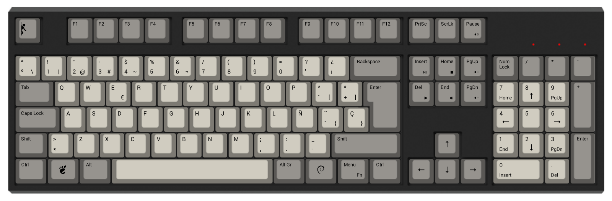
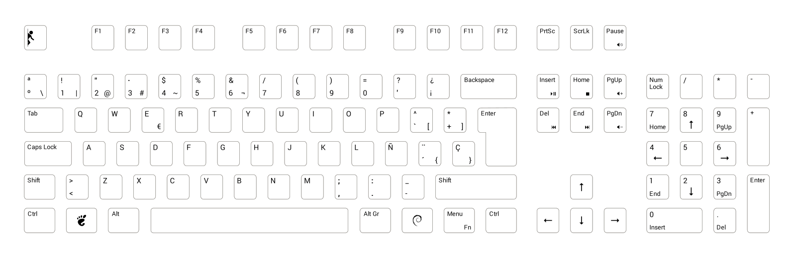

WASD keyboard layout
====================

Custom layout for [WASD V2 105-Key ISO Mechanical Keyboard](http://www.wasdkeyboards.com/index.php/products/mechanical-keyboard/wasd-v2-105-key-iso-custom-mechanical-keyboard.html) I made, the key distribution is for Spanish.

I used the SVG template [available](http://support.wasdkeyboards.com/customer/portal/articles/1380026-layout-template-files) on the WASD Keyboard site and [Inkscape](https://inkscape.org/) to make the changes.

The font used is Roboto v1.2 (available [here](https://developer.android.com/design/style/typography.html) and [here](http://www.google.com/fonts/specimen/Roboto)).

Remember, before add your layout to your order in the WASD Keyboards site you must **convert all fonts and texts to paths**.

You can find more information to make your custom layout at the [WASD Keyboards support page](http://support.wasdkeyboards.com/customer/portal/articles/1518370-creating-a-custom-layout).
